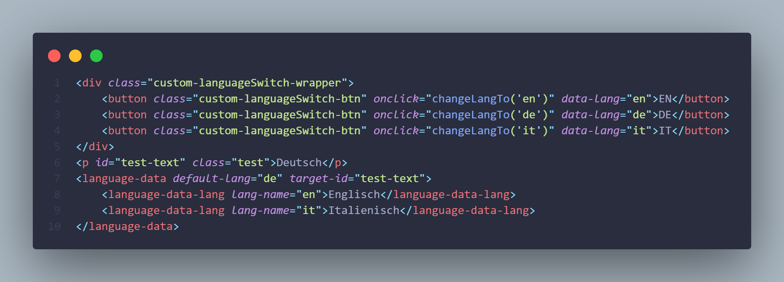

# hup-cdn-libraries

[https://www.jsdelivr.com/github](https://www.jsdelivr.com/github)


## language-switcher.js

Um den language switcher zu benutzen musst du nur ganz unten im html den cdn einbinden:

```
<script src="https://cdn.jsdelivr.net/gh/HaugUndPartner/hup-cdn-libraries@main/language-switcher/language-switcher.js"></script>
```

Usage:


